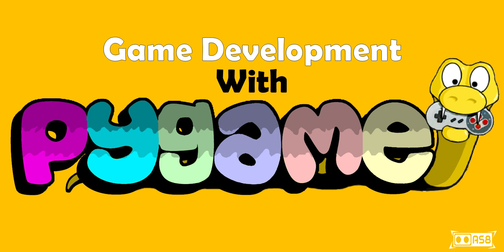

# _GameDev with Pygame_

In this repository, I have added basics codes of Pygame with sufficient comments as description so that anyone could know what each line doing in the background. After going through this repository, learners will be able to create cool 2D and 3D games.

# Resources
I am very much grateful to-
* [Official Documentation](https://www.pygame.org/docs/) of Pygame
* [TechwithTimm](https://www.youtube.com/playlist?list=PLzMcBGfZo4-lp3jAExUCewBfMx3UZFkh5) Youtube Channel
* [Sentdex](https://www.youtube.com/playlist?list=PLQVvvaa0QuDdLkP8MrOXLe_rKuf6r80KO) Youtube Channel
* [Freecodecamp](https://www.youtube.com/watch?v=FfWpgLFMI7w&t=292s) Youtube Channel

# License
Details can be found in [LICENSE](LICENSE)
